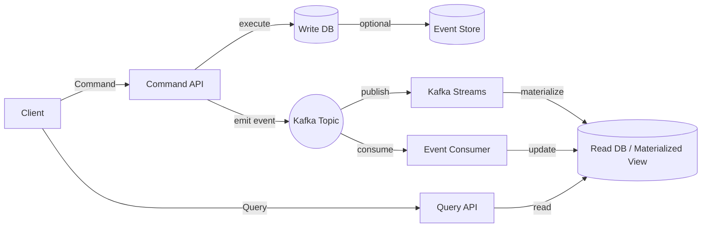
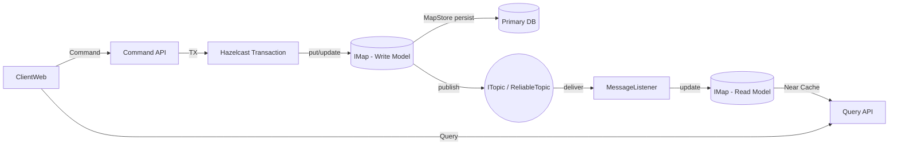

# Hazelcast로 CQRS 패턴 도입하기

## CQRS의 아이디어

OOP에선 SRP 원칙이 존재한다. Single Responsibility Principle, 단일 책임 원칙이다.
단일 객체는 단일 책임을 지님으로서 다른 객체와의 의존성을 줄이고 클래스의 관심사를 명확하게 하여 관심사가 흩어지는 것을 방지한다.

이는 OOP의 아이디어지만, 데이터를 사용하는 애플리케이션 설계에도 유사한 아이디어를 적용할 수 있다.
데이터를 읽는 행위와 쓰는 행위는 서로 다른 관심사이기 때문이다.

## Write - Read의 행위

DB의 역할은 크게 데이터를 쓰고 읽는 행위로 이루어진다.

일반적인 용례에서, 쓰는 행위는 영향도를 체크하고 추적하기 위해 각종 audit 컬럼과 log를 남기고, 트랜잭션을 관리하며, 데이터의 무결성을 보장하는 데 집중한다. 반면 읽는 행위는 빠른 응답성과 다양한 조회 조건에 집중한다. 보통 DTO를 통해 필요한 데이터만 선별하여 비즈니스 로직을 처리한다.

이와 같이 쓰기와 읽기는 서로 다른 관심사이기 때문에, 하나의 데이터 모델로 이 둘을 모두 만족시키기는 어렵다.

## 단일 데이터 모델의 한계

단일 데이터 모델로 쓰기와 읽기를 모두 만족시키려면 다음과 같은 트레이드오프가 발생한다.
금융권에서는 `select for update` 구문을 통해 배타락을 걸어 데이터의 무결성을 보장하는 경우가 많다. 이 경우 읽기 작업이 지연되는 현상이 자주 발생한다.

실제로, 대용량 처리 시 batch job이 동시에 돌거나 동시 요청이 들어오면서 lock 해소까지 수십 분이 소요되는 현상을 겪었다. 해당 케이스는 인덱스 설계와 쿼리 튜닝으로 어느 정도 해결할 수 있었지만, 쓰기 vs 읽기 경합이라는 구조적 문제는 남아 있었다.

이 지점에서 CQRS가 의미를 갖기 시작한다.

## CQRS 패턴 도입

CQRS(Command Query Responsibility Segregation) 패턴은 쓰기와 읽기 작업을 명확히 분리하여 각각의 관심사에 집중할 수 있도록 한다. 특히 대용량 데이터 처리와 실시간 응답성이 요구되는 현대 환경에서 더욱 필요성이 높아지고 있다.

CQRS는 일반적으로 다음 방식으로 구현된다:

1. **쓰고 읽는 모델 분리**
2. **이벤트 소싱(Event Sourcing)** – 쓰기 작업을 이벤트로 기록
3. **비동기 처리** – 이벤트 브로커(Kafka 등) 기반

그러나 온프레미스 환경에서는 Kafka 같은 메시징 시스템 운영이 어려울 수 있다. 이때 Hazelcast가 현실적인 대안으로 떠오른다.

---

# Hazelcast가 현실적인 이유

온프레 기반 정산 시스템에서는 새로운 메시징 플랫폼 구축이 큰 리스크다. 하지만 Hazelcast는 별도의 메시징 시스템 없이도 CQRS의 핵심 구성 요소를 제공한다.

Hazelcast는 인메모리 데이터 그리드로서 다음 기능을 제공한다:

* **분산 Map(IMap)** → 쓰기/읽기 모델 분리
* **Topic / ReliableTopic** → 이벤트 전파
* **MessageListener / EntryListener** → 이벤트 기반 동기화
* **MapStore** → RDBMS 영속화
* **Near Cache** → 읽기 성능 극대화

즉, Kafka 없이도 CQRS 구조를 온전히 구현할 수 있는 실전 친화적 선택지다.

---

# Hazelcast 기반 CQRS 구조

---

# Hazelcast CQRS를 명확하게 정리

## 1. 이벤트 동기화 흐름

쓰기 작업 → WriteModel 반영 → Topic으로 이벤트 발행 → Listener 수신 → ReadModel 업데이트

이벤트는 최소한의 정보만 가진다:

* aggregateId
* 변경 타입
* version
* timestamp

쓰기 요청은 빠르게 끝나고, 데이터 동기화는 비동기로 진행된다.

## 2. 순서 보장은 어떻게 하나?

Hazelcast Topic은 Kafka처럼 강력한 파티션 보장은 제공하지 않지만, 다음 전략으로 충분한 순서를 확보한다.

* aggregateId 기반 라우팅
* ReliableTopic 사용
* ReadModel에 version 필드 두고 **낮은 버전 무시**

## 3. 중복 이벤트 처리

네트워크 지연·재시도 상황 대비:

* ReadModel에 version 필드 포함
* 이미 처리한 버전 이하는 무시 (멱등성 보장)

## 4. 읽기 모델 설계

읽기 모델은 조회 패턴 중심으로 설계한다.

* 정규화 해제된 구조
* 리스트/집계 중심 Materialized View
* 단건 조회 최적화를 위한 인덱스 구성
* Near Cache 활성화 → 로컬 메모리에서 즉시 조회

## 5. 초기 동기화

Hazelcast ReadModel 구축 절차:

1. 배치로 전체 데이터 적재
2. 이후 이벤트 기반 실시간 동기화
3. 필요 시 스냅샷으로 빠른 복구

## 6. 운영 시 모니터링 포인트

* IMap entry 수 및 메모리 사용량
* GC 동작 패턴
* 네트워크 지연 / split-brain 여부
* 이벤트 처리 지연(latency)
* MapStore 쓰기 속도

---

# 기대 효과

## 1) 읽기/쓰기 충돌 제거

읽기는 ReadModel, 쓰기는 WriteModel로 분리되므로 DB 락 경합이 사라진다.

## 2) 조회 성능 극대화

* Near Cache → 로컬 메모리 응답
* 조인 없는 조회 모델 설계

## 3) 운영 난이도 감소

Kafka/Redis 스트림 없이 CQRS 가능.
온프레에서도 안정적으로 운영할 수 있다.

## 4) 아키텍처 명확성 증가

Command · Query가 분리되어 도메인 규칙이 선명해지고 유지보수성이 증가한다.
