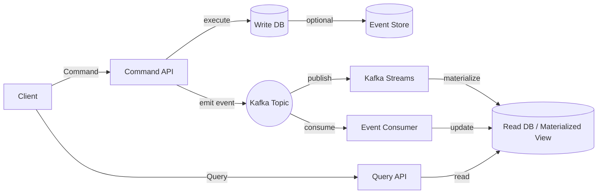
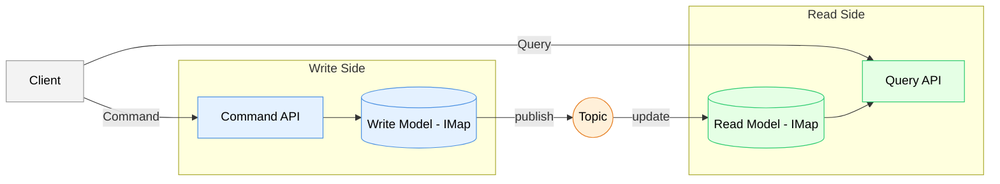

# Hazelcast로 CQRS 패턴 도입하기 (1)

## CQRS의 아이디어

OOP에선 SRP 원칙이 존재한다. **Single Responsibility Principle**, 단일 책임 원칙이다.
단일 객체는 단일 책임을 지님으로서 다른 객체와의 의존성을 줄이고 클래스의 **관심사를 명확**하게 하여 **관심사가 흝어지는** 것을 방지한다.

이는 OOP의 아이디어지만, 데이터를 사용하는 애플리케이션 설계에도 유사한 아이디어를 적용할 수 있다.
데이터를 읽는 행위와 쓰는 행위는 **서로 다른 관심사**이기 때문이다.

## Write - Read의 행위

DB의 역할은 크게 데이터를 쓰고 읽는 행위로 이루어진다.

일반적인 용례에서, 쓰는 행위는 영향도를 체크하고 추적하기 위해 각종 audit 컬럼과 log를 남기고, 트랜잭션을 관리하며, 데이터의 무결성을 보장하는 데 집중한다. 반면 읽는 행위는 빠른 응답성과 다양한 조회 조건에 집중한다. 보통 DTO를 통해 필요한 데이터만 선별하여 비즈니스 로직을 처리한다.

이와 같이 쓰기와 읽기는 서로 다른 관심사이기 때문에, 하나의 데이터 모델로 이 둘을 모두 만족시키기는 어렵다.

## 단일 데이터 모델의 한계

단일 데이터 모델로 쓰기와 읽기를 모두 만족시키려면 다음과 같은 트레이드오프가 발생한다.
금융권에서는 `select for update` 구문을 통해 배타락을 걸어 데이터의 무결성을 보장하는 경우가 많다. 이 경우 읽기 작업이 지연되는 현상이 자주 발생한다.

개인적으로는, 대용량 처리 시 batch job이 동시에 돌거나 동시 요청이 들어오면서 **lock 해소까지 수십 분이 소요**되는 현상을 겪었다. 해당 케이스는 인덱스 설계와 쿼리 튜닝으로 어느 정도 해결할 수 있었다. 또 서버 스펙을 올리고 여러 보완책을 시도했지만, 근본적인 해결책은 되지 못했다. **쓰기 vs 읽기 경합이라는 구조적 문제**는 잔존해서 계속 팀을 괴롭혔다.

바로 이 지점에서 CQRS가 의미를 갖기 시작한다는 생각이 들었다. 

## CQRS 패턴 

**CQRS(Command Query Responsibility Segregation) 패턴**은 쓰기와 읽기 작업을 명확히 분리하여 각각의 관심사에 집중할 수 있도록 한다. 특히 대용량 데이터 처리와 실시간 응답성이 요구되는 현대 어플리케이션 환경에서 더욱 필요성이 높아지고 있다.

CQRS는 일반적으로 다음 방식으로 구현된다:

1. **쓰고 읽는 모델 분리**
2. **이벤트 소싱(Event Sourcing)** – 쓰기 작업을 이벤트로 기록
3. **비동기 처리** – 이벤트 브로커(Kafka 등) 기반



그러나 온프레미스 환경에서는 Kafka 같은 메시징 시스템 운영이 어려울 수 있다. 이때 Hazelcast가 현실적인 대안으로 떠오른다.


---


## Hazelcast가 유효한 이유

온프레미스에서 Kafka·Redis 같은 메시징 플랫폼을 새로 구축하기 위해 여러방면으로 시도했으나 쉽지 않았다.
운영 인력 부족, 보안 정책 제약, 인프라 비용 등 현실적인 문제가 크기 때문이다.

Hazelcast는 별도의 메시징 인프라를 추가하지 않고도 다음 핵심 기능을 제공한다.

* **분산 캐시/데이터 그리드(IMap)**
  쓰기 모델과 읽기 모델을 각각 독립적으로 유지할 수 있다.
* **Topic / ReliableTopic 기반 메시징**
  이벤트를 분산 환경에서 안정적으로 브로드캐스팅한다.
* **Listener 기반 비동기 동기화**
  변경 이벤트를 자동으로 감지해 읽기 모델을 실시간 갱신한다.
* **MapStore 영속화**
  메모리 ↔ RDBMS 간 자동 동기화로 운영 부담을 낮춘다.
* **Near Cache**
  빈번한 조회를 로컬 메모리에서 처리해 응답 속도를 극대화한다.

Hazelcast는  Kafka·Redis에서 얻기 원하는 핵심 기능이 다 마련되어 있다.
“추가 인프라 없이 CQRS를 구현해야 한다”는 제약 조건이 있을 때 최적의 선택지라는 생각이 들었다.

---

## Hazelcast 기반 CQRS 구조

Hazelcast로 CQRS의 핵심 흐름인 **(1) 쓰기 모델 → (2) 이벤트 발행 → (3) 읽기 모델 반영**을  구현한다.


- 쓰기 (Write): 사용자가 데이터를 입력하면 '쓰기 전용 저장소(Map A)'에 저장한다.
- 알림 (Notify): "데이터가 바뀌었다!"고 Hazelcast가 자체적으로 방송(Topic)한다.
- 동기화 (Sync): 방송을 들은 '읽기 전용 저장소(Map B)'가 자기 데이터를 최신으로 업데이트한다.



핵심 구성 요소:

1. **WriteMap**
   WriteModel 전용 IMap. 트랜잭션 하에서 데이터의 일관성을 보장한다.
2. **Topic/ReliableTopic**
   쓰기 후 발생한 이벤트를 모든 노드에 전파하는 역할.
3. **Listener**
   이벤트를 받아 ReadModel을 업데이트한다.
4. **ReadMap + Near Cache**
   조회 특화 구조로 구성된 IMap. 거의 모든 조회가 로컬 메모리에서 처리된다.

WriteModel과 ReadModel은 물리적으로 분리되므로, 쓰기 이벤트가 많아도 조회 성능이 저하되지 않는다.

---

## CQRS 구현 설계

중요하게 고려할 사항을 설계해 보았다.

### 1. 이벤트 동기화 흐름

1. Command 처리
2. WriteModel 업데이트
3. Hazelcast Topic으로 이벤트 발행
4. Listener가 이벤트를 수신
5. ReadModel 업데이트

이벤트에는 조회에 필요한 최소한의 메타데이터만 포함한다.

* `aggregateId`
* `eventType`
* `version`
* `timestamp`

동기화는 비동기로 진행한다.

---

### 2. 순서 보장 전략

Hazelcast Topic은 Kafka만큼 강력한 파티션 모델을 갖지 않지만, 다음 전략으로 일관된 순서를 확보할 수 있다.

* **aggregateId 기반 라우팅 또는 key 기반 파티셔닝**
  동일 aggregate는 동일 파티션(리스트너)에서 처리.
* **ReliableTopic 사용**
  메시지 손실 및 재시도에 강하다.
* **ReadModel에 version 필드 유지**
  최신 버전보다 낮은 이벤트는 버림 → 순서 오류에도 일관성 유지.

정렬을 맞춰놓지 않고도 정렬이 깨진 이벤트를 자동으로 걸러내는 구조이다.

---

### 3. 중복 이벤트 처리(멱등성 확보)

네트워크 지연·리트라이·노드 재시작 등으로 동일 이벤트가 여러 번 들어올 수 있다.
Hazelcast 기반 CQRS에서는 다음 방식으로 해결한다.

* ReadModel의 각 entry에 **version 필드 저장**
* 이벤트 처리 시

  ```
  if (event.version <= currentVersion) skip
  ```
* 최종적으로 최신 버전만 적용

---

다음 글에서는 Hazelcast 기반 CQRS를 PoC로 돌려보는 과정을 다룰것이다.
