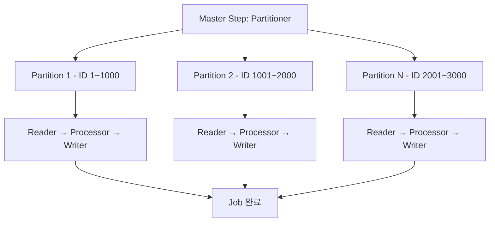

정산은 한번에 처리해야 할 데이터가 많습니다.  
수십만건이 일반적인 케이스이고, 종종 수백만건을, 가끔 수천만건을 처리하기도합니다.

계산식도 복잡합니다.

처리에 실패하거나 데이터 정합성이 맞지 않으면 영향도가 큽니다.

>  **데이터 정합성이란?** 데이터가 일치하고 올바른 상태를 의미합니다.  
즉, 정산 시스템에서는 고객이 결제한 금액, 수수료 계산 결과, 가맹점이 받을 정산 금액, 집계 결과 등이 올바르게 맞아떨어져야합니다.  

이런 환경에서 대용량 데이터를 반복적으로 검증하는 작업은 상당한 부담이었습니다. 배치 처리 시간이 길어질수록 시스템 리소스 사용량이 증가하고, 오류 발생 시 영향 범위도 커지기 때문입니다.

따라서 저희 팀은 배치 시스템의 성능과 안정성을 동시에 개선하는 방안을 여러방면에서 검토했습니다.

이번 글에서는 정산 배치 시스템에서 실제로 성능을 크게 개선했던 방법 세 가지를 꾹꾹 눌러담아 공유하겠습니다. 

---

## 1. Offset 에서 'No Offset' 으로

### Offset의 한계 
Spring Batch는 대용량 데이터를 효율적으로 처리하기 위해 `Chunk` 단위로 데이터를 끊어서 처리합니다. 

데이터를 끊어서 가져올 땐 보통 Paging을 사용하며, JPA Paging을 사용하면 기본적으로 `offset` 키워드 기반으로 페이징 처리를 하게 됩니다.

배치의 JpaPagingItemReader도 offset 방식으로 동작합니다.

```sql
SELECT * FROM post ORDER BY created_at DESC OFFSET 1000 LIMIT 10;
```

이때 OFFSET이 1000이면, DB는 먼저 1000개의 row를 스캔하여 건너뛰고, 이후의 10개를 가져옵니다. 데이터 양이 많아질수록 건너뛰는 작업의 비용이 커지고 성능이 급격히 저하됩니다. 

---

페이징 쿼리의 축적 : 배치라는 특수한 상황을 생각하면.. 쿼리를 여러번 조회하므로 그 횟수만큼 또는 그 이상 시간이 소요되어 데이터가 늘어날 수수록 10분이면 끝나던 Job이 **40분넘게** 걸리는 현상이 생깁니다.

해당 현상은 관계형 데이터베이스의 고질적인 이슈로 **Offset Inefficiency Problem**이라는 용어로 정리하면 깔끔할듯합니다.

#### 세줄 요약  

> 1. `OFFSET N`은 일단 첫 N개의 row를 **scan한 후 무시(discard)** 합니다. 
> 2. OFFSET 값이 커질수록 데이터베이스는 불필요한 I/O와 CPU 연산을 반복합니다. 
> 3. 이로 인해 성능이 선형적으로 저하되는 구조적인 한계가 있습니다.


### No Offset의 성능 안정성  

**반면 No Offset 방식**은 마지막으로 읽은 레코드의 키(단일키나 복합키의 일부)를 기준으로 다음 페이지를 조회합니다.  
예를 들어 `시작 id < 마지막 id` 같은 조건을 사용합니다.
이렇게 하면 DB는 인덱스를 통해 바로 적절한 시작 지점을 찾아 **항상 limit 개수만큼만 빠르게 조회**합니다. 
즉, OFFSET처럼 앞 데이터를 불필요하게 읽지 않고, 성능을 일정하게 유지할 수 있습니다.


또한 프로그램 실행 중간에 다른 데이터 블록에 삽입이나 삭제가 발생해도 정합성을 유지한 채 다음 페이지를 안전하게 조회할 수 있습니다. 

다만 No Offset 방식에서 꼭 **주의할 점**이 있습니다. 집계 쿼리의 경우 no offset key의 범위와 order by와 group by에서 의도한 집계범위가 일치하는지 확인해야합니다. 만약 key의 범위가 order by 및 group by 컬럼과 맞지 않는다면 집계되어야할 항목이 누락될 수 있습니다. 

세세한 검토가 필요합니다. 그래서 집계쿼리의 경우 Offset 방식으로 선택한 후 No Offset으로의 전환을 고려하는 방향을 추천드립니다.

---
 
## 2. 병렬 처리 방법 
### 병렬 처리의 시작: TaskExecutor

정산 시스템처럼 대용량 데이터를 처리해야 하는 경우, 단일 스레드로는 처리 시간이 오래 걸릴 수 있습니다. 이럴 때 Spring Batch의 `TaskExecutor`를 활용하면 Step 내부에서 **멀티스레드 기반으로 청크 처리**가 가능합니다. 즉, 한 Step 내에서도 동시에 여러 청크를 병렬로 처리하고, 쓰는 구조로 실행됩니다.

여기서 `taskExecutor()`는 스레드 풀을 정의하는 구성 요소이며, `throttleLimit`은 동시에 실행할 최대 스레드 수를 제한합니다. 저희 팀은 운영 환경에서 다음과 같은 이유로 `SimpleAsyncTaskExecutor`를 사용 중입니다:

- 배치 실행 빈도가 낮아 순간적인 리소스 사용에 부담이 비교적 적음
- 배치 서버가 독립적으로 구성되어 있어 시스템 간 간섭이 없음

다만, `SimpleAsyncTaskExecutor`는 요청마다 새 스레드를 생성하기 때문에, 
장기 실행 Job이나 동시 처리량이 많은 경우에는 메모리 과부하 위험이 있습니다. 
따라서 `ThreadPoolTaskExecutor` 전환도 고려하고 있습니다.

#### 병렬 처리의 실제 대상은?

멀티스레드 실행 시 먼저 확인할 점은 사용하는 ItemReader가 thread-safe하지 확인하는 것입니다.

- `JpaPagingItemReader`는 스레드 세이프합니다. 
- `read()`를 병렬적으로 호출할 순 있지만 스레드세이프한 Reader는 내부적인 `lock`을 명시적으로 걸기때문에 **실질적인 병렬 처리 개선은 Processor, Writer 단계에서 발생**합니다.

taskExecutor는 StepBuilder에서 간단히 적용할 수 있습니다.

```java
return new StepBuilder("payoutCreateStep", jobRepository)
    .<TempPayoutDTO, PayoutTarget>chunk(1000, transactionManager)
    .reader(payoutBaseReader)
    .processor(payoutCreateProcessor)
    .writer(payoutCreateWriter)
    .taskExecutor(taskExecutor())
    .listener(stepListener)
    .build();
```

### 쪼개고 나누어 처리하기: `Partitioner`

정산 시스템은 처리 대상이 수백만 건에 이르기 때문에, 단일 스레드 기반의 일괄 처리로는 성능과 운영 안정성 모두를 만족하기 어렵습니다. 이럴 때 Spring Batch의 `Partitioner`를 활용하면 데이터기준으로 스텝을 여러 파티션으로 나누어 병렬로 처리할 수 있어 전체 처리 시간을 **크게 단축**할 수 있습니다.

`Partitioner`는 마스터-슬레이브 구조로 동작합니다. 마스터 스텝이 각 파티션의 범위(예: ID 1~1000, 1001~2000 등)를 설정하면, 슬레이브 스텝이 해당 범위에 대해 독립적인 Reader-Processor-Writer 흐름을 실행합니다. 파티셔너는 `TaskExecutor`와 함께 사용되어 병렬 처리됩니다.

```java
@Component
public class CustomPartitioner implements Partitioner {
    
    @Override
    public Map<String, ExecutionContext> partition(int gridSize) {
        Map<String, ExecutionContext> partitions = new HashMap<>();
        
        // 동적으로 min max 값이 변경되고 균등분포를 보장할수 없는경우
        // 분포를 고려한 쿼리 조회도 필요합니다.
        List<Long> boundaries = selectMinMax(gridSize); 
        
        for (int i = 0; i < gridSize; i++) {
            ExecutionContext context = new ExecutionContext();
            context.putLong("minId", boundaries.get(i));
            context.putLong("maxId", boundaries.get(i + 1));
            partitions.put("partition" + i, context);
        }
        return partitions;
    }

}
```

#### 균등 분할이 핵심입니다

파티션을 나누는 것만으로는 충분하지 않습니다. 각 파티션에 일정한 분량이 할당되지 않으면 **전체 작업이 가장 늦은 파티션의 속도에 맞춰지게 됩니다**.

파티션을 나누는 코드가 ID 기준으로 균등하게 분할할 수 있습니다.

```java
int gridSize = 4; // 병렬 스레드 수
long min = jdbcTemplate.queryForObject("SELECT MIN(id) FROM settlement_l", Long.class);
long max = jdbcTemplate.queryForObject("SELECT MAX(id) FROM settlement_l", Long.class);
long targetSize = (max - min + 1) / gridSize;
```

그 결과 각 슬레이브는 자신에게 주어진 ID 범위만 조회하여 독립적으로 데이터를 처리하게 됩니다.
실제로 인덱스 적용과 함께 데이터가 균등분할되도록 조정하여 이행배치 성능을 789만건기준 50분에서 7분으로 개선하기도 했습니다.



#### StepScope + ExecutionContext: 파티션 간 상태 분리

각 슬레이브 스텝의 Reader에는 `@StepScope`를 적용하고, 파티션마다 다른 파라미터(ID 범위 등)를 `ExecutionContext`로 전달합니다. 이렇게 하면 **각 스레드는 서로 간섭 없이 독립된 상태로 작업을 수행**할 수 있습니다.

####  기억할 포인트

- 데이터 쏠림을 방지하기 위해 정렬되지 않은 키 기준은 피하기
- Reader는 thread-safe한 구현 또는 범위 분할을 통해 독립성 확보

Partitioner는 데이터 규모가 크고 처리 단위가 병렬처리할 수 있다면 반드시 고려해야 할 전략입니다. 쪼개는 방식이 성능을 좌우한다는 점을 기억해주세요!

---

## 3. 진짜 병목은 어디에 : Slow Query

사실 성능 저하의 대부분의 원인은 슬로우 쿼리입니다. 
배치 프로그램의 성능개선도 쿼리 튜닝이랑 깊은 관련이 있으며 쿼리부터 다시 검토해보는게 중요하다고 생각합니다.   
저희는 보통 다음과 같은 방법으로 성능을 개선했습니다.

####  1. 실행계획 때려보기

가장먼저 PostgreSQL 기준 `EXPLAIN ANALYZE`로 실제 수행 시간과 인덱스 활용 여부를 확인합니다.
PostgreSQL DB 툴인 `pgAdmin`에서 시각화된 실행 계획을 볼수도 있습니다. 개인적으로 시각화했을때  가시성이 훨씬 좋아서 pdAdmin에서 실행계획을 돌려보시길 더 추천합니다.
실행계획에서 어떤 join이 적용되었는지 확인해보시면 됩니다.

인덱스가 적용된 컬럼 기준으로 조회했더라도 쿼리에 따라 효율적인 scan 방식이 달라질 수 있습니다. 그래서 해당 용어들의 의미를 파악해야 튜닝을 하기 용이해집니다.

쿼리 튜닝시 전체적인 방향성은 `코스트와 조회 건수를 줄이는 것`에 초점을 맞추시면 됩니다.


| 항목    | Index Scan                             | Sequential Scan              |
| ----- | -------------------------------------- | ---------------------------- |
| 사용 조건 | 조건절(WHERE)에 인덱스 컬럼이 포함 + 선택도가 높을 때 | 인덱스가 없거나, 전체 데이터를 거의 다 읽는 경우 |
| 동작 방식 | 인덱스를 먼저 검색한 후 해당 row로 점프               | 테이블을 처음부터 끝까지 순차적으로 읽음       |
| 성능    | 소량 데이터에 빠름                             | 대량 읽기에는 효율적인 경우도 있었음          |
| 장점    |  필요 row만 조회                   | 단순 구조, 인덱스 오버헤드 없음           |
| 단점    | 조건이 부정확하거나 너무 많으면 오히려 느려짐              | 무조건 다 읽기 때문에 큰 테이블에선 느림      |


> 선택도(Selectivity)가 높다는 것은 조회되는 건수가 적다는 뜻입니다.


| 항목    | Nested Loop Join              | Hash Join                          |
| ----- | ----------------------------- | ---------------------------------- |
| 사용 조건 | 소량의 루프 대상 / 인덱스 존재            | 대량 데이터 / 인덱스 없을 때                  |
| 동작 방식 | 외부 테이블의 각 row마다 내부 테이블을 반복 탐색 | 내부 테이블을 해시 테이블로 만들고 외부 row를 해시로 매칭 |
| 성능    | 적은 데이터에서 빠름                   | 대량 조인 시 뛰어난 성능                     |
| 장점    | 인덱스 활용 가능, 조건 복잡해도 됨          | 대용량 조인 성능 우수                       |
| 단점    | 조인 대상이 많아지면 급격히 느려짐           | 메모리를 많이 사용                  |


####  2. 쿼리 고치기

위의 실행 계획을 통해 보통 아래와 같이 수정하는 과정을 거칩니다.

-  join/where 조건 수정
- 복잡한 join을  두 단계로 나누기
- 일부 조건은 application 레벨에서 필터링

쿼리 하나로 끝내겠다는 생각이 오히려 상당한 성능 저하로 이어지기도 합니다.
`CompositeItemReader`를 고려하는등 쿼리를 두개로 나누었을때 불필요한 join이 제거되면서 성능이 개선되는 경우가 많았습니다. 
쿼리 뿐 아니라 프로그래밍 상에서의 여러옵션을 고려해보시길 권합니다.

#### 3. 돌고돌아 인덱스가 중요합니다.


저희는 처리량이 많거나 일정 시간 이상 소요되는 쿼리에 대해
**clustered index**, **non-clustered index**, **brin index**  등을 실험했고
적절한 인덱스를 추가함으로써 몇배에서 수십배 개선되는 경우가 많았습니다.


| 인덱스 종류                  | 설명                                   | 사용 DB                                | 특징                                       |
| ----------------------- | ------------------------------------ | ------------------------------------ | ---------------------------------------- |
| **Clustered Index**     | 테이블 자체가 인덱스로 구성됨. 기본키에 자주 사용         | MSSQL, PostgreSQL (유사 구조: `CLUSTER`) | 빠른 정렬/범위 조회, 테이블 하나에 하나만 존재할수 있음             |
| **Non-Clustered Index** | 테이블과 분리된 보조 인덱스. 하나의 테이블에 여러 개 생성 가능 | MSSQL, PostgreSQL                    | 다양한 쿼리 조건 최적화에 사용됨                       |
| **BRIN Index**          | 범위 단위 인덱스 (Block 단위 요약 정보만 저장)       | PostgreSQL                           | 매우 큰 테이블에서 시퀀스성 데이터 있는 열에 적합 |

인덱스를 추가하실 때는 해당 테이블의 일반적인 용례와 사이드이펙트를 고려해서 추가하시길 권합니다!

---

## 마치며

정산 배치는 민감한 시스템입니다.
실패하면 금전적인 손해로 이어질 수 있고,
느리면 검증 스케줄 및 일일 운영 스케줄 전체에 영향을 줍니다.
그래서 성능개선을 다각도에서 검토해야합니다.  

그런 경험을 하나의 포스팅에 최대한 담아보았으나, 
분량 조절을 위해 생략된 내용도 있습니다. 

배치를 경험해보신 분들은 리마인드하는 시간이, 
성능 이슈를 고민하시는 분들은 참고가되는 시간이 되셨길 바랍니다.
감사합니다.


## References

- https://joojimin.tistory.com/76
- https://jojoldu.tistory.com/528
- https://github.com/spring-projects/spring-batch/blob/d8fc58338d3b059b67b5f777adc132d2564d7402/spring-batch-samples/src/main/java/org/springframework/batch/sample/common/ColumnRangePartitioner.java
- https://www.postgresql.org/docs/current/brin.html
- https://medium.com/@yasoob2897/why-you-should-not-use-offset-in-your-sql-5eea98c2db27
- https://use-the-index-luke.com/no-offset
